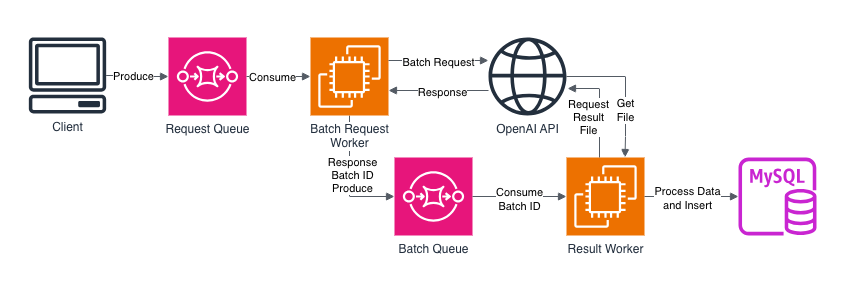
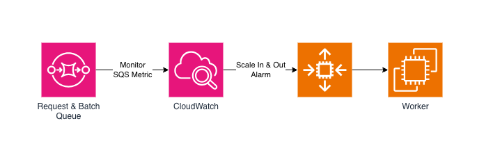

# FWIKI_Nova (NOVA)
- OpenAI API를 사용하여 파엠히 캐릭터 대사를 자동 번역하는 애플리케이션
- 이름은 역두문자어같은거 딱히 아니고 맘에 드는걸로 붙엿셈

## About
- 대량 Batch 작업을 염두에 두고 Spring WebFlux 를 사용해 Non-Blocking Application 으로 구현
  - 수동 트리거링을 위해서 Netty WAS 를 통한 Web Endpoint 도 만들었지만 기본적으론 사용하지 않음
- Messaging Queue 를 사용해 (SQS) Wiki 레거시 웹 애플리케이션과 디커플링
  - 금전 문제 상 Database 는 분리하지 못했지만 레거시 웹 애플리케이션의 변경에도 영향받지 않도록 큐를 사용함
  - Queue 에 잔여 메시지가 존재할 때에만 Instance 를 실행하고, 잔여 메시지가 없다면 인스턴스를 종료하여 사용 요금 절감
  - Lambda 를 사용하는 쪽이 더 좋았겠지만, RDS 를 사용하지 않아서 Database Connection 의 보안을 위해서 (특정 보안 그룹에만 포트 개방 등등) 새로운 Instance 에 작업 애플리케이션을 올리는 것으로 최종 결정하였음
- OpenAI Batch 를 사용하여 AI 작업과 애플리케이션을 디커플링하고, API 사용 요금 또한 절감
  - WebHook 을 사용해서 Insert 작업을 처리하는 방법도 있지만, Queue 에 Batch Create 시 Id 를 쌓아놓고 처리하도록 함
    - Spot Instance 를 사용할 것을 고려하였기에 애플리케이션에서 직접 WebHook 호출을 받을 수 없었고
    - WebHook 을 Lambda 등에서 받아 처리한 후 Queue 에 메시지를 삽입할 수도 있지만 API Gateway 를 붙여야 하기에 추가요금이 아까움

### Architecture Diagram
- Application Flow

- Auto Scaling

### Application Flow
- 관리용 애플리케이션에서 번역할 캐릭터를 선택 
- 선택한 캐릭터를 SQS Request Queue에 전송

- Request Queue의 처리되지 않은 메시지 수가 1개 이상이라면, Worker Instancea를 실행

- Request Queue 에서 메시지 묶음을 받아, OpenAI API에 Batch 작업을 요청
- Batch Id를 Batch Queue에 전송

- Batch Queue에서 Batch ID를 받아 해당 Batch Job이 완료되었는지 확인
  - 완료되지 않았다면 Queue의 메시지를 완료 처리하지 않고, 일정 시간 대기함
- Batch Job이 완료되었으면, 정보를 받아서 관계형 데이터베이스에 정리하고 Queue의 메시지를 완료 처리

- Request Queue와 Batch Queue 의 처리되지 않은 메시지 수가 0개라면, Worker Instance를 종료